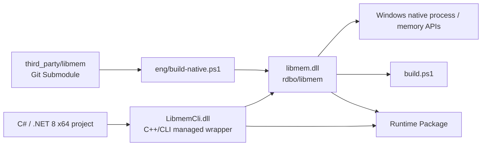

# LibmemCli — libmem 5.x C++/CLI wrapper (Windows x64 / .NET 8)

[简体中文](README.md) | [English](README.en.md)

[](https://github.com/HearthstoneModding/Libmem/actions/workflows/build.yml)
[](LICENSE)


LibmemCli is a reusable C++/CLI wrapper around the C ABI of [rdbo/libmem](https://github.com/rdbo/libmem), intended for Windows x64 / .NET 8 projects.

The wrapper exposes every public function in the pinned libmem header through managed models, managed byte arrays, and .NET-friendly APIs. Normal libmem functions and their `Ex` variants are generally represented as overload pairs.

The native libmem library is included as a pinned Git submodule and is built automatically before the C++/CLI wrapper.

- Upstream project: [rdbo/libmem](https://github.com/rdbo/libmem)
- C API: [include/libmem/libmem.h](https://github.com/rdbo/libmem/blob/master/include/libmem/libmem.h)


## Architecture



The runtime call chain is **C#/.NET → LibmemCli.dll → libmem.dll → Windows Native API**. During builds, the pinned libmem submodule produces the native DLL first, followed by the C++/CLI managed wrapper.

## Requirements

- Windows x64
- Visual Studio with:
  - **Desktop development with C++**
  - **C++/CLI support for the v143 build tools**
- Windows SDK
- .NET 8 SDK
- CMake
- Git

## Clone and build

Clone recursively so the pinned libmem source and its dependencies are available:

```powershell
git clone --recursive https://github.com/HearthstoneModding/Libmem.git
cd Libmem
.\build.ps1 -Configuration Release
```

`build.ps1` will:

1. initialize all Git submodules;
2. build the pinned native libmem library;
3. stage native headers, import libraries, and runtime DLLs;
4. build the C++/CLI solution.

`bootstrap.ps1` remains available as a compatibility alias.

You can also open `LibmemCli.sln` directly and build either `Debug|x64` or `Release|x64`. Visual Studio/MSBuild will perform the same native prerequisite build automatically.

Generated files are kept outside the source directories:

```text
artifacts/native/x64/Release/bin/libmem.dll
artifacts/native/x64/Release/lib/libmem.lib
artifacts/managed/x64/Release/LibmemCli.dll
artifacts/managed/x64/Release/Ijwhost.dll
```


## C# quick example

After referencing `LibmemCli.dll`, managed code can access process and module information directly:

```csharp
using LibmemCli;

var process = Libmem.CurrentProcess();

Console.WriteLine(
    $"Process: {process.Name}  PID={process.Pid}  Arch={process.Architecture}  Bits={process.Bits}");

foreach (var module in Libmem.EnumModules(process))
{
    Console.WriteLine(
        $"{module.Name}  Base=0x{module.Base:X}  Size=0x{module.Size:X}");
}
```

At runtime, keep `LibmemCli.dll`, `Ijwhost.dll`, and `libmem.dll` beside the application executable.

## Consume as a Git submodule

Add this repository to another project as a submodule:

```powershell
git submodule add https://github.com/HearthstoneModding/Libmem.git external/Libmem
git submodule update --init --recursive
```

Then add:

```text
external/Libmem/src/LibmemCli.vcxproj
```

to the consuming solution and reference it from the .NET 8 x64 project with a `ProjectReference`.

Build the full solution with Visual Studio MSBuild so the C++/CLI toolchain is available.

Project and output paths are based on this repository rather than the consuming solution, so the submodule may be placed at any stable location.

At runtime, deploy the following files beside the consuming executable:

- `LibmemCli.dll`
- `Ijwhost.dll`
- `libmem.dll`

Do not mix outputs from different configurations or commits.


## GitHub Actions automation

The repository includes three automation workflows:

- \`.github/workflows/build.yml\`: builds Release x64 on pushes to \`main\`, pull requests, or manual runs, then uploads the \`LibmemCli-windows-x64\` artifact.
- \`.github/workflows/reusable-build.yml\`: exposes the build through \`workflow_call\` so other GitHub repositories can reuse it.
- \`.github/workflows/release.yml\`: builds tags matching \`v*\`, creates a GitHub Release, and attaches \`LibmemCli-windows-x64.zip\`.

You can create the same runtime package locally:

```powershell
.\build.ps1 -Configuration Release
.\eng\package-runtime.ps1 -Configuration Release
```

Output:

```text
artifacts/package/LibmemCli-windows-x64/
├─ LibmemCli.dll
├─ Ijwhost.dll
├─ libmem.dll
├─ VERSION
├─ manifest.json
├─ LICENSE
└─ THIRD_PARTY_NOTICES.md

artifacts/package/LibmemCli-windows-x64.zip
```

## Versioning and automated validation

The root `VERSION` file is the source of truth for release versioning. The first stable-candidate version is **0.1.0**, and the generated `LibmemCli.dll` carries matching assembly version metadata.

Each runtime package contains a `manifest.json` recording:

- the LibmemCli package version;
- the repository Git commit;
- the pinned upstream libmem commit;
- target framework (`net8.0`);
- platform (`win-x64`);
- build configuration (Debug / Release).

CI validates more than compilation:

1. **API Contract Check** parses the pinned submodule's `include/libmem/libmem.h`, extracts every public `LM_API`, and fails if upstream exposes a public API that the C++/CLI wrapper does not reference.
2. **Runtime Smoke Tests** load `LibmemCli.dll + libmem.dll` and exercise process/module enumeration, memory allocation/read/write/protection, Data/Pattern/Signature scanning, assembly, and disassembly.

Hook and VMT operations are intentionally not hard requirements of the baseline smoke suite yet, avoiding unstable false failures caused by Windows execution-environment or toolchain differences.

### Reuse the build from another repository

Another repository can call the reusable workflow directly:

```yaml
jobs:
  build-libmem:
    uses: HearthstoneModding/Libmem/.github/workflows/reusable-build.yml@main
    with:
      ref: main
      configuration: Release
      artifact-name: LibmemCli-windows-x64

  use-libmem:
    needs: build-libmem
    runs-on: windows-2022
    steps:
      - uses: actions/download-artifact@v4
        with:
          name: LibmemCli-windows-x64
          path: external/Libmem
```

The caller does not need to duplicate Libmem's build scripts; the artifact is uploaded directly to the caller's workflow run.

> While this repository is private, cross-repository reuse requires GitHub Actions access settings that allow the caller repository to use this reusable workflow. If the repository becomes public later, public repositories can reference it directly.

## API mapping

### Processes

The following libmem APIs are exposed through `Libmem` process methods:

- `LM_EnumProcesses`
- `LM_GetProcess`
- `LM_GetProcessEx`
- `LM_FindProcess`
- `LM_IsProcessAlive`
- `LM_GetCommandLine`
- `LM_FreeCommandLine`
- `LM_GetBits`
- `LM_GetSystemBits`

### Threads, modules, symbols, and segments

Thread, module, symbol, and segment `LM_*` enumeration/find/get/load/unload APIs are mapped to their corresponding `Libmem` methods.

Enumeration results are fully materialized as managed `List<T>` values.

### Memory operations

The following APIs are exposed as overloads with or without a `ProcessInfo` argument:

- `LM_ReadMemory[Ex]`
- `LM_WriteMemory[Ex]`
- `LM_SetMemory[Ex]`
- `LM_ProtMemory[Ex]`
- `LM_AllocMemory[Ex]`
- `LM_FreeMemory[Ex]`
- `LM_DeepPointer[Ex]`

### Scanning

The following APIs are exposed as managed byte/string scanning methods:

- `LM_DataScan[Ex]`
- `LM_PatternScan[Ex]`
- `LM_SigScan[Ex]`

### Assembly and disassembly

Assembly/disassembly APIs are exposed through:

- `Libmem.Assemble`
- `Libmem.Disassemble`
- `Libmem.CodeLength`
- `Libmem.GetArchitecture`

Native assembly-result buffers are freed after being copied into managed memory.

### Hooks

- `LM_HookCode[Ex]` → `Libmem.HookCode`
- `LM_UnhookCode[Ex]` → disposable `HookHandle`

The native VMT API is wrapped by the disposable `VmtManager`.

## Important behavior and limitations

1. **The current sample project is x64 only.** Address arguments and results use `UInt64`; on x64, libmem's failure sentinel `LM_ADDRESS_BAD` is `UInt64.MaxValue`. `0` is not an error sentinel for every API. The wrapper does not automatically elevate privileges and does not provide remote-architecture translation or kernel-memory support.

2. `ReadMemory` returns **only the bytes actually read**. `WriteMemory` returns the actual number of bytes written. Callers should check for short reads and partial writes. A zero-byte result may indicate an inaccessible address.

3. `ProcessInfo` and `ModuleInfo` are snapshots, not operating-system handles. A process can exit and module/address information can become stale. `IsProcessAlive` checks the original identity using `pid` plus startup time.

4. `GetCommandLine` returns UTF-8 strings and frees native allocations. The string helper rejects embedded NUL characters. Enumeration callbacks are synchronous.

5. `Disassemble(codeAddress, arch, ...)` expects `codeAddress` to point to readable machine code in the **calling process**, not a remote-process address. For remote code, call `ReadMemory` first and pass the resulting byte array to the safe pinned-buffer `Disassemble(byte[], ...)` overload.

6. Hooks require executable native targets and replacements with the correct calling convention, signature, architecture, and lifetime. **A C# delegate address is not automatically a safe detour.** For a remote hook, `destination` must refer to code in the **remote process**; this wrapper does not inject that code for you. Dispose `HookHandle` explicitly while the target code and process are still valid. Its finalizer intentionally does not restore modified code from a GC thread.

7. The VMT manager is **local-process only**. Dispose it while the original vtable is still valid and do not use arbitrary or untrusted addresses. Internal VMT entries are not automatically synchronized with concurrent modifications.

8. Allocation, modification, and free operations are low-level APIs and require matching region sizes and protection settings. Some native APIs operate at page granularity. `ProcessInfo` does not own these allocations, so disposing it does not implicitly call `VirtualFree` or restore memory permissions.

9. Runtime deployment requires matching copies of:
   - `libmem.dll`
   - the .NET C++/CLI `Ijwhost.dll`

   beside the consuming executable.

## License

This C++/CLI wrapper repository is distributed under **GNU AGPL-3.0-only**.

The pinned upstream libmem submodule uses the same license.

See the following for details:

- `LICENSE`
- `THIRD_PARTY_NOTICES.md`
- the upstream libmem submodule license and corresponding source
