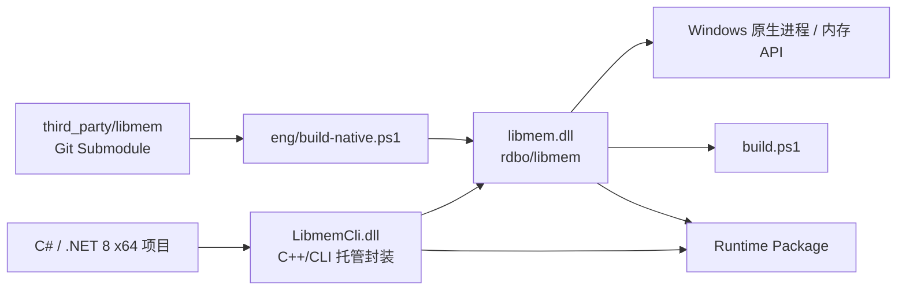

# LibmemCli — libmem 5.x C++/CLI 封装（Windows x64 / .NET 8）

[简体中文](README.md) | [English](README.en.md)

[](https://github.com/HearthstoneModding/Libmem/actions/workflows/build.yml)
[](LICENSE)


LibmemCli 是对 [rdbo/libmem](https://github.com/rdbo/libmem) C ABI 的可复用 C++/CLI 封装，面向 Windows x64 / .NET 8 项目。

本项目封装了当前固定版本 libmem 头文件中公开的全部函数，并使用托管模型、托管字节数组以及符合 .NET 使用习惯的 API 暴露给 C# / .NET。libmem 中普通函数与 `Ex` 函数通常在托管层对应为一组重载。

原生 libmem 以固定版本的 Git Submodule 引入，并会在构建 C++/CLI 封装前自动编译。

- 上游项目：[rdbo/libmem](https://github.com/rdbo/libmem)
- C API：[include/libmem/libmem.h](https://github.com/rdbo/libmem/blob/master/include/libmem/libmem.h)


## 项目架构



运行时调用链为 **C#/.NET → LibmemCli.dll → libmem.dll → Windows Native API**。构建时则由仓库固定的 libmem Submodule 生成原生 DLL，再构建 C++/CLI 托管封装。

## 环境要求

- Windows x64
- Visual Studio，并安装：
  - **使用 C++ 的桌面开发**
  - **适用于 v143 生成工具的 C++/CLI 支持**
- Windows SDK
- .NET 8 SDK
- CMake
- Git

## 克隆与构建

请使用递归方式克隆仓库，以确保固定版本的 libmem 源码及其依赖同时被拉取：

```powershell
git clone --recursive https://github.com/HearthstoneModding/Libmem.git
cd Libmem
.\build.ps1 -Configuration Release
```

`build.ps1` 会自动完成：

1. 初始化所有 Git Submodule；
2. 编译固定版本的原生 libmem；
3. 整理原生头文件、导入库和运行时 DLL；
4. 构建 C++/CLI 解决方案。

`bootstrap.ps1` 仍保留为兼容入口。

也可以直接打开 `LibmemCli.sln`，使用 `Debug|x64` 或 `Release|x64` 构建。Visual Studio/MSBuild 会自动执行相同的原生依赖构建流程。

生成文件不会写入源码目录，默认输出到：

```text
artifacts/native/x64/Release/bin/libmem.dll
artifacts/native/x64/Release/lib/libmem.lib
artifacts/managed/x64/Release/LibmemCli.dll
artifacts/managed/x64/Release/Ijwhost.dll
```


## C# 快速示例

引用 `LibmemCli.dll` 后，可以直接通过托管 API 获取当前进程与模块信息：

```csharp
using LibmemCli;

var process = Libmem.CurrentProcess();

Console.WriteLine(
    $"Process: {process.Name}  PID={process.Pid}  Arch={process.Architecture}  Bits={process.Bits}");

foreach (var module in Libmem.EnumModules(process))
{
    Console.WriteLine(
        $"{module.Name}  Base=0x{module.Base:X}  Size=0x{module.Size:X}");
}
```

运行时请确保 `LibmemCli.dll`、`Ijwhost.dll` 和 `libmem.dll` 位于应用程序可执行文件旁。

## 作为 Git Submodule 引用

可以在其他项目中将本仓库作为 Submodule 引入：

```powershell
git submodule add https://github.com/HearthstoneModding/Libmem.git external/Libmem
git submodule update --init --recursive
```

然后将：

```text
external/Libmem/src/LibmemCli.vcxproj
```

加入使用方解决方案，并在 .NET 8 x64 项目中通过 `ProjectReference` 引用它。

建议使用完整的 Visual Studio MSBuild 构建整个解决方案，以确保 C++/CLI 工具链可用。

项目路径和输出路径均基于 Libmem 仓库自身，而不是使用方解决方案，因此 Submodule 可以放在任意稳定目录中。

运行时需要将以下文件部署到使用方可执行文件同目录：

- `LibmemCli.dll`
- `Ijwhost.dll`
- `libmem.dll`

请勿混用不同构建配置或不同提交生成的文件。


## GitHub Actions 自动构建

仓库内置三套自动化工作流：

- \`.github/workflows/build.yml\`：向 \`main\` 推送、创建 PR 或手动运行时自动构建 Release x64，并上传 \`LibmemCli-windows-x64\` Artifact。
- \`.github/workflows/reusable-build.yml\`：可被其他 GitHub 仓库通过 \`workflow_call\` 直接复用。
- \`.github/workflows/release.yml\`：推送 \`v*\` 标签时自动构建并创建 GitHub Release，同时附带 \`LibmemCli-windows-x64.zip\`。

本地也可以生成与 CI 相同的 Runtime 包：

\`\`\`powershell
.\build.ps1 -Configuration Release
.\eng\package-runtime.ps1 -Configuration Release
\`\`\`

输出：

\`\`\`text
artifacts/package/LibmemCli-windows-x64/
├─ LibmemCli.dll
├─ Ijwhost.dll
├─ libmem.dll
├─ LICENSE
└─ THIRD_PARTY_NOTICES.md

artifacts/package/LibmemCli-windows-x64.zip
\`\`\`

## 版本与自动验证

项目使用根目录的 `VERSION` 文件作为发布版本来源，当前首个稳定候选版本为 **0.1.0**。构建后的 `LibmemCli.dll` 会写入对应的程序集版本信息。

Runtime 包中的 `manifest.json` 会记录：

- LibmemCli 包版本；
- 当前仓库 Git commit；
- 固定的上游 libmem commit；
- 目标框架（`net8.0`）；
- 平台（`win-x64`）；
- 构建配置（Debug / Release）。

CI 不只检查“能否编译”，还会执行两层自动验证：

1. **API Contract Check**：直接解析固定 Submodule 中的 `include/libmem/libmem.h`，提取所有公开 `LM_API`，如果上游新增公开 API 但 C++/CLI wrapper 尚未引用，构建会失败。
2. **Runtime Smoke Tests**：实际加载 `LibmemCli.dll + libmem.dll`，验证进程/模块枚举、内存申请与读写、内存保护、Data/Pattern/Signature Scan、汇编与反汇编。

Hook / VMT 暂不作为基础 Smoke Test 的硬性门禁，以避免不同 Windows 执行环境和工具链造成不稳定的假失败。

### 在其他项目中复用构建工作流

其他仓库可以直接调用本仓库的构建工作流：

\`\`\`yaml
jobs:
  build-libmem:
    uses: HearthstoneModding/Libmem/.github/workflows/reusable-build.yml@main
    with:
      ref: main
      configuration: Release
      artifact-name: LibmemCli-windows-x64

  use-libmem:
    needs: build-libmem
    runs-on: windows-2022
    steps:
      - uses: actions/download-artifact@v4
        with:
          name: LibmemCli-windows-x64
          path: external/Libmem
\`\`\`

这样调用方无需复制 Libmem 的编译脚本，构建产物会直接出现在调用方的 Workflow Run 中。

> 当前仓库为私有仓库时，跨仓库复用需要在 GitHub Actions 的仓库/组织访问设置中允许调用方仓库访问该 reusable workflow；如果以后将仓库公开，则公开仓库可直接引用。

## API 映射

### 进程

以下 libmem API 映射为 `Libmem` 的进程相关方法：

- `LM_EnumProcesses`
- `LM_GetProcess`
- `LM_GetProcessEx`
- `LM_FindProcess`
- `LM_IsProcessAlive`
- `LM_GetCommandLine`
- `LM_FreeCommandLine`
- `LM_GetBits`
- `LM_GetSystemBits`

### 线程、模块、符号与内存段

线程、模块、符号和 Segment 相关的 `LM_*` 枚举、查找、获取、加载与卸载函数会映射到 `Libmem` 中对应的方法。

枚举结果会完整转换为托管 `List<T>`。

### 内存操作

以下 API 在托管层提供带或不带 `ProcessInfo` 参数的重载：

- `LM_ReadMemory[Ex]`
- `LM_WriteMemory[Ex]`
- `LM_SetMemory[Ex]`
- `LM_ProtMemory[Ex]`
- `LM_AllocMemory[Ex]`
- `LM_FreeMemory[Ex]`
- `LM_DeepPointer[Ex]`

### 扫描

以下 API 映射为托管字节数组或字符串扫描方法：

- `LM_DataScan[Ex]`
- `LM_PatternScan[Ex]`
- `LM_SigScan[Ex]`

### 汇编与反汇编

汇编/反汇编相关 API 映射为：

- `Libmem.Assemble`
- `Libmem.Disassemble`
- `Libmem.CodeLength`
- `Libmem.GetArchitecture`

原生汇编结果缓冲区在复制到托管内存后会被正确释放。

### Hook

- `LM_HookCode[Ex]` → `Libmem.HookCode`
- `LM_UnhookCode[Ex]` → 可释放的 `HookHandle`

原生 VMT API 则封装为可释放的 `VmtManager`。

## 重要行为与限制

1. **当前示例项目仅支持 x64。** 地址参数和返回值使用 `UInt64`。在 x64 下，libmem 的失败哨兵值 `LM_ADDRESS_BAD` 对应 `UInt64.MaxValue`。并非所有 API 都以 `0` 表示失败。本项目不会自动提权，也不提供远程架构转换或内核内存支持。

2. `ReadMemory` **只返回实际成功读取的字节**；`WriteMemory` 返回实际写入长度。调用方应检查短读取和未完整写入的情况。返回 0 字节可能表示目标地址不可访问。

3. `ProcessInfo` 和 `ModuleInfo` 是状态快照，而不是操作系统句柄。目标进程可能已经退出，模块与地址也可能失效。`IsProcessAlive` 会根据原始身份（`pid` + 启动时间）进行检查。

4. `GetCommandLine` 返回 UTF-8 字符串，并负责释放原生分配。`string` 辅助方法拒绝包含嵌入式 NUL 的字符串。枚举回调为同步执行。

5. `Disassemble(codeAddress, arch, ...)` 要求 `codeAddress` 指向**当前调用进程**中可读的机器码，而不是远程进程地址。需要反汇编远程代码时，应先调用 `ReadMemory`，再将返回的字节数组传给安全的固定缓冲区重载 `Disassemble(byte[], ...)`。

6. Hook 要求目标和替换函数均为有效的可执行原生代码，并且调用约定、函数签名、架构和生命周期必须正确。**C# Delegate 的地址并不会自动成为安全的 Detour。** 安装远程 Hook 时，`destination` 必须指向**远程进程中的代码**；本封装不会自动完成代码注入。请在目标代码和进程仍有效时显式释放 `HookHandle`。其 Finalizer 不会在 GC 线程中恢复被修改的代码。

7. VMT 管理器**仅支持本地进程**。请在原始 VTable 仍有效时释放它，不要向其传入任意或不可信地址。内部 VMT 条目不会自动与其他并发修改操作进行线程同步。

8. 内存分配、修改与释放接口属于底层 API，调用方需要正确匹配区域大小和保护属性。部分原生 API 以页面粒度工作。`ProcessInfo` 并不拥有这些资源，因此释放 `ProcessInfo` 时不会隐式执行 `VirtualFree`，也不会自动恢复内存权限。

9. 运行时必须在使用方可执行文件旁提供与当前构建匹配的：
   - `libmem.dll`
   - .NET C++/CLI 所需的 `Ijwhost.dll`

## 许可证

本 C++/CLI 封装仓库使用 **GNU AGPL-3.0-only** 许可证。

固定版本的上游 libmem Submodule 同样使用该许可证。

详细信息请参阅：

- `LICENSE`
- `THIRD_PARTY_NOTICES.md`
- 上游 libmem Submodule 中的许可证与对应源代码
